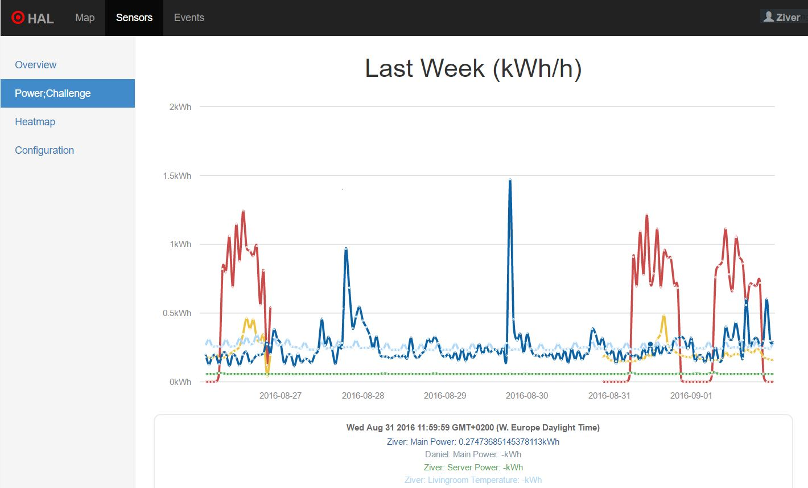
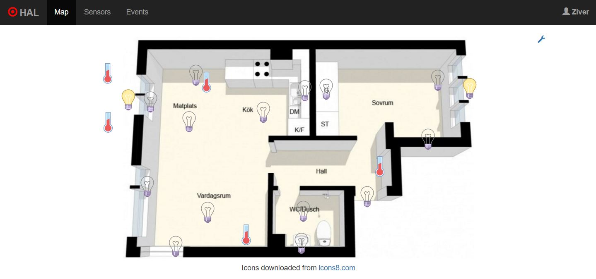
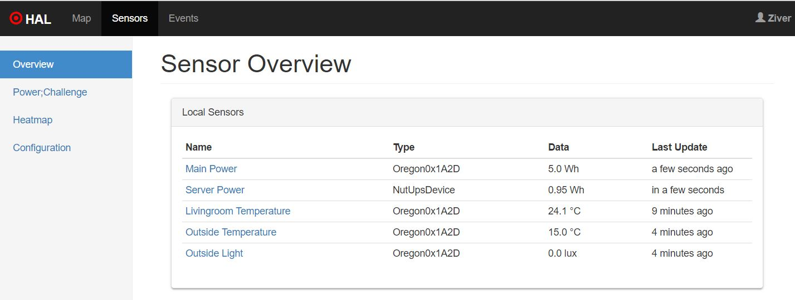
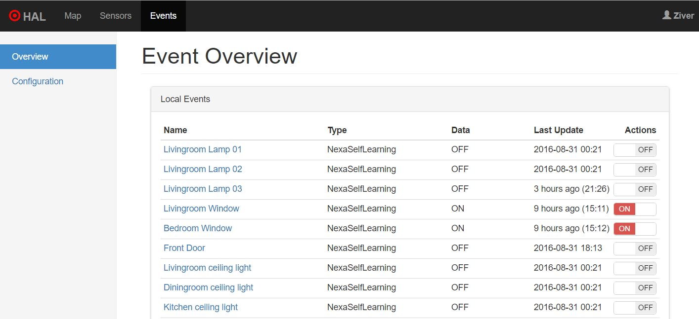

# Hal

Hal is a home automation hub with sensor statistics with the functionality to 
share that data between friends. It has been developed to be very extensible so future 
Sensors and other input devices can be supported.

Features:
- **Map**, Set up a house map with sensors and events mapped on a floorplan
- **Triggers and Actions**, IFTTT type functionality
- **Power;Challenge**, Sync power or sensor usage between friends to challenge each other to lower the power usage
- **[Google Assistant Integration](plugins/hal-assistant-google/READNME.md)**

Currently supported devices:
- **Network Scanner**, IP scanner to detect devices on local network
- **NUT**, Linux UPS daemon
- **Tellstick**, Supported devices:
  - NexaSelfLearning
  - Oregon0x1A2D
- **Raspberry Pi**, GPIO connected sensors
- **[Zigbee](plugins/hal-zigbee/README.md)**
  - Temperature Sensors
  - Humidity Sensors
  - Pressure Sensors
  - OnnOff Devices

Under development (Not ready to be used yet)
- **Z-Wave**
- **Google Assistant**
- **MQTT Devices**

The project is currently in alpha state, and as such things will change and break continuously.

### Screenshots








## Installing

To run the Hal server you first need to clone the git repository and then run the 
gradle command to build and run the server:

```
./gradlew run
```

Check `hal.conf.example` for available configuration options. 
By default, HAL server will be listening to http://localhost:8080. 

## Running the tests

The current test coverage is greatly lacking, but to run the available JUnit 
test-cases run:

```
./gradlew test
```

## Architecture

```
 HalAbstractControlerManager
       |
       |             HalAbstractController
       |                   |
       |                   |              HalAbstractDevice
       |                   |                   |
 .-----------.       .------------.       .--------.  
 |           |       |            |       |        |
 |           |       |            | ----> | Device | 
 |           |       |            |       |        |
 |           | ----> | Controller |       '--------'
 |           |       |            |       .--------.  
 |           |       |            |       |        |
 |  Manager  |       |            | ----> | Device | 
 |           |       |            |       |        |
 |           |       '------------'       '--------'
 |           |       .------------.       .--------.  
 |           |       |            |       |        |
 |           | ----> | Controller | ----> | Device | 
 |           |       |            |       |        |
 '-----------'       '------------'       '--------'
         
```

## Authors

* **Daniel Collin**
* **Ziver Koc**


## License

This project is licensed under the MIT License - see the 
[LICENSE.txt](LICENSE.txt) file for details

## Acknowledgments

* Tellstick, for open-sourcing their code 
